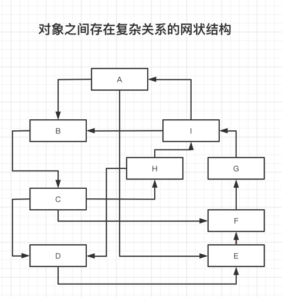
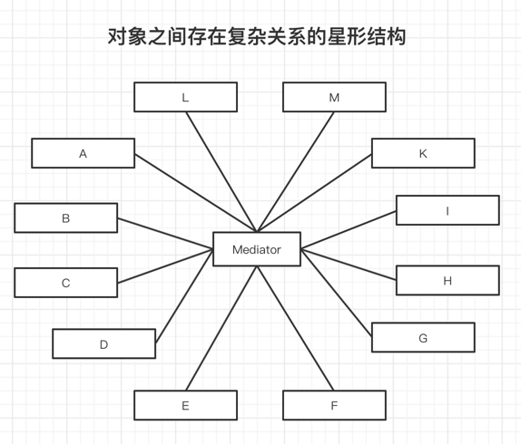
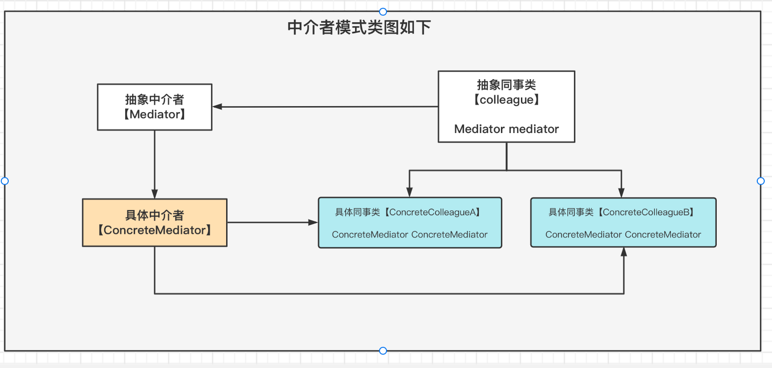
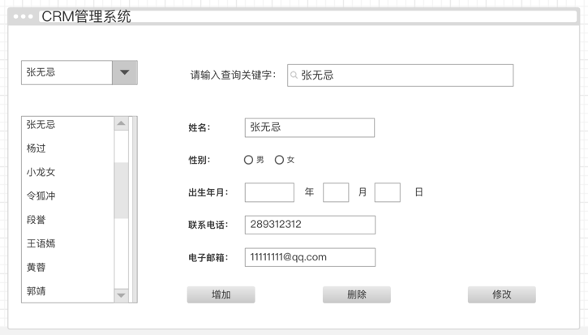

## 中介者模式

### 来源
   如果在一个系统中 对象与对象之间的联系呈现网格状，他们之间通过彼此的相互
 作用实现系统的行为。类似QQ用户之间的关系，此时特别需要一个类似"QQ群"的中间类
来协调这些类/对象之间的复杂关系，以降低系统的耦合。

中介者模式以此而诞生，它通过在系统中增加中介者对象来降低原理类/独享之间的复杂饮用关系

 
> 网状结构

> 星形结构

> 类图

## 优缺点

#### 一、优点
- 1、简化了对象之间的交互，它用中介者和同事的一对多交互代替了原来的同事之间的多对多交互。
一对多关系更容易理解，维护和扩展。将原本难以理解的网状结构转换成相对简单的星形结构

- 2、可以将更同事对象解耦。中介者有利于各同事之间的松耦合。可以独立的改变和复用每一个同事和中介者。增加新的中介者类和新同事类都比较方便。更好的符合开闭幕原则

- 3、可以减少子类的生成，中介者将原本分布于多个对象间的行为集中在一起。改变这些行为只需要生成新的中介者子类即可，这使得各个同事类可以被重用，无须对同事类进行扩展

#### 二、缺点

在具体的中介者类中包含了大量同事之间的交互细节，可能会导致具体中介者类非常的复杂 使得系统难以维护

## 适用环境
- 1、系统中对象之间存在复杂的饮用刮洗，系统结构混乱且难以理解

- 2、一个对象由于饮用其他很对对象并且直接和这些对象通信，导致难以复用该对象

- 3、想通过一个中间类来封装多个类中的行为，而又不想生成太多的子类。此时可以通过中介者类来实现，在中介者中定义对象交互的公共行为，如果需要改变行为则可以增加新的具体中介者类

## 场景案例

如果删除一个客户，则将会从客户列表中删除对应的项。客户选择组合框中的客户名称也将减少一个；如果增加一个客户信息，则客户列表中将增加一个客户，并且组合框中也将增加一项
