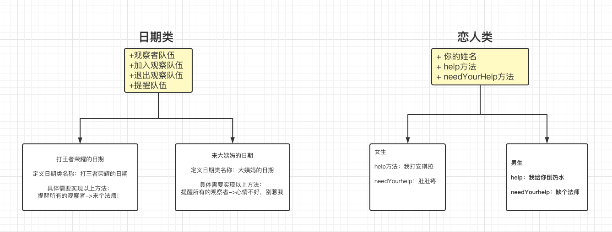

- 今天：从大姨妈的角度 来学习观察者模式
> 观察者模式概念：
一个对象状态的变化会引起其他对象的相关变化,如会触发相关的方法

> 概念映射过来：当女生来大姨妈了，请各位相关人士积极主动的给予关爱

结下来我们分析整个过程的演变：

1  宏观角度来讲，有个维系整件事情的线索。啥，观察/记录情绪不对劲的那几天，简单来说【日期】

2  那我们是不是需要明白谁来观察日历呢？没错，所有的相关人员都需要观察

3  明确了责任之后，我们来推演下一步会发生什么？
   某天，女友发了一个朋友圈："终究是一个人 默默的扛下所有的痛"
   朋友们，兄弟们是不是应该有所表示了
---
### 故事讲完了：这就是观察者模式！ 

**什么**？讲了什么 又好像啥也没讲～～

我们紧接着提炼出类图如下：

代码实现如下：

