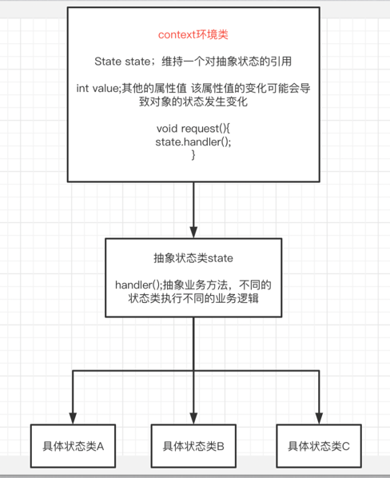

## 概念
状态模式用于解决系统中复杂对象的状态转换以及不同状态下行为的封装问题
。

当系统中的某个对象存在多个状态，这些状态之间可以进行转换，而且对象在不同状态下行为不相同时可以使用状态模式

## 类图

## 优缺点

### 优点
1 状态模式封装了状态的转换规则，在状态模式中可以将状态的转换代码封装在环境或者具体状态类中，可以对状态转换代码进行集中管理

2 状态模式将所有的与某个状态有关的行为放到一个类中 只需要注入一个不同的状态对象即可使环境对象拥有不同的行为

### 缺点
状态模式会增加系统中类和对象的个数 导致系统运行开销增大

