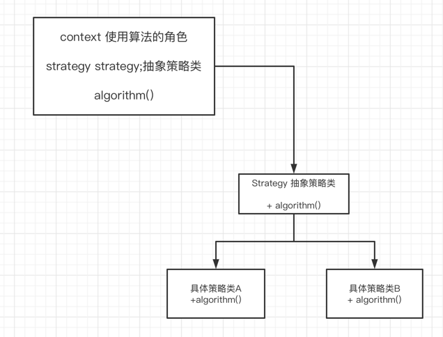

## 策略模式概念
  定义一系列算法，将每一个算法封装起来，并让他们可以相互替换。策略模式让算法可以独立与使用它的客户而变化

在实现某一个功能时有多种算法，一个常用的方法是通过硬编码将所有的算法集中在一个类中，在该类中提供多个方法，每一个方法对应一个具体的算法
也可以将这些肃反啊封装在一个统一的方法 通过if...else...等条件判断语句进行选择。
## 类图

## 优缺点

### 优点
 1 策略模式提供了对开闭原则的完美支持 在不改变原有系统的基础上选择算法或者行为，也可以灵活的增加新的算法或者行为
  
 2 使用策略模式 可以避免多重条件选择语句。多重条件选择语句不易维护 策略模式提供了一种算法的复用机制 由于算法单独提取出来封装在策略类中 因此不同的环境类可以方便的复用这些算法

### 缺点
1 客户端必须知道所有的策略类 并自行决定使用哪一种策略类 这就意味这客户端必须理解这些算法的区别

2 无法同时在客户端使用多个策略类 
