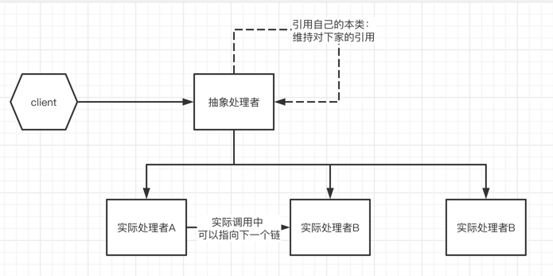

## 职责链模式概要

避免将一个请求的发送者与接收者耦合在一起，让多个对象都有处理的机会。将接受到的请求连接成一条链 并且沿这个链进行传递请求，直到有一个对象能够处理它为止

## 职责链类型

- [x] 一条直线
- [x] 一个环
- [x] 一个树形结构

## 类图

## 优缺点
### 优点
1 处理一个请求仅需维持一个指向其后继者的引用，而不需要维持它对所有的候选者的引用，可以简化对象之间的相互连接

2 给对象分配职责时 职责链可以更灵活一些

3 新增一个具体的请求时 无需修改原有系统的代码，只需要重新建链就可以

### 缺点
1 请求没有明确的接收者 就会出现请求不一定被处理。也可能因为职责链没有被正确配置 而得不到处理

2 建链不当时 可能会出现死循环

## 职责链又分为纯职责链/ 不纯的职责链

纯职责链：一个处理者要么处理完整的处理这个请求 要么交给下个链执行这个请求

不纯的职责链：允许一个请求被处理者处理一部分后再传给下一个链
